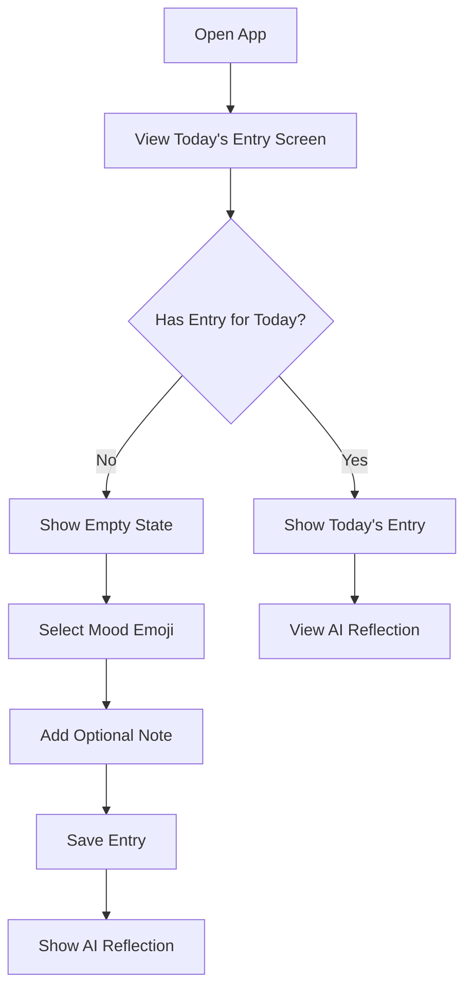
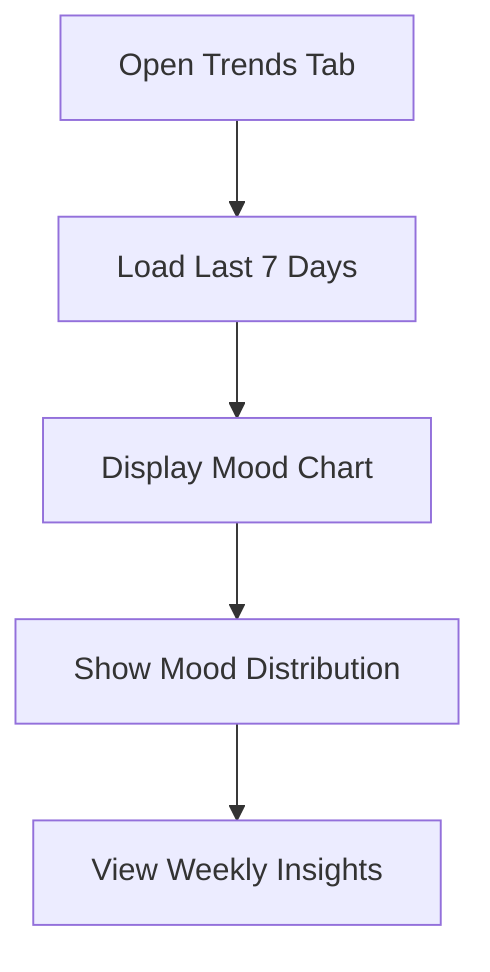

# Daily Mood Tracker - Design Document

## User Flow

### 1. Daily Mood Entry (Main Tab)


### 2. Trends View (Second Tab)


## Core Features

### 1. Daily Mood Check-in
- One mood entry per day
- Simple emoji selection (😊 Happy, 😌 Calm, 😐 Neutral, 😔 Sad, 😫 Stressed)
- Optional short note (max 280 chars)
- Beautiful animations on selection
- Cannot edit past entries (encourages honesty)

### 2. AI Reflections
- Immediate reflection after entry
- Contextual based on:
  - Current mood
  - Past 7 days trend
  - Time of day
- Short, encouraging messages
- Option to save favorite reflections

### 3. Mood Trends
- 7-day rolling view
- Visual mood distribution
- Color-coded for easy reading
- Simple animations on data load

## States & Transitions

### Entry Screen States
1. **Empty State (First Visit)**
   - Welcome message
   - Quick tutorial overlay
   - Prominent mood selector

2. **Empty State (Daily)**
   - Today's date
   - "How are you feeling today?"
   - Mood emoji grid

3. **Filled State**
   - Today's mood displayed
   - AI reflection card
   - Option to view trends

### Trends Screen States
1. **Loading**
   - Smooth gradient placeholder
   - Subtle loading animation

2. **Data View**
   - 7-day chart
   - Weekly mood distribution
   - Key insights

3. **Empty State**
   - Encouraging message
   - Example chart preview
   - "Start tracking" CTA

## Data Structure

```typescript
interface MoodEntry {
  id: string;
  user_id: string;
  date: string;
  mood: 'happy' | 'calm' | 'neutral' | 'sad' | 'stressed';
  emoji: string;
  note?: string;
  created_at: string;
}

interface AIReflection {
  id: string;
  entry_id: string;
  message: string;
  created_at: string;
}
```

## Retention Strategy

1. **Daily Reminders**
   - Gentle notification at user's preferred time
   - Customizable reminder message
   - Option to disable

2. **Engagement Features**
   - Streak counting
   - Weekly mood insights
   - Shareable AI reflections

3. **Progress Visualization**
   - Beautiful trend animations
   - Color psychology in design
   - Micro-interactions for delight

## Visual Language

### Colors
- Primary Gradient: #7C3AED (Purple) → #4F46E5 (Indigo)
- Background: #F8FAFC (Light Gray)
- Text: #1E293B (Dark Blue Gray)
- Accents: Various pastel shades for moods

### Typography
- Headers: Bold, clean sans-serif
- Body: Regular weight, high readability
- Emoji: Native platform emoji for consistency

### Animations
- Smooth transitions between states
- Subtle hover effects on interactive elements
- Gentle loading states
- Celebratory animations for streaks